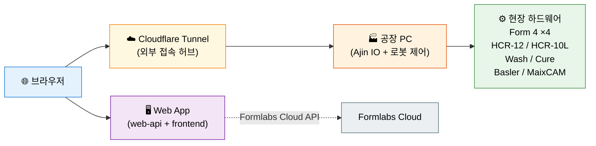
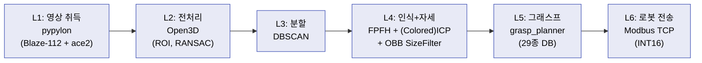

# 3D Printer Automation System

> 3D프린터-로봇 연동 자동화 시스템 | Formlabs Form 4 + HCR 협동로봇 + 3D 빈피킹 비전 + 엣지 AI

[](https://python.org)
[](https://fastapi.tiangolo.com)
[](https://react.dev)
[](https://typescriptlang.org)
[](https://tailwindcss.com)
[](https://vitejs.dev)
[](https://docker.com)
[](http://www.open3d.org)
[](https://pymodbus.readthedocs.io)
[](https://www.baslerweb.com)
[](https://www.intelrealsense.com)
[](https://mosquitto.org)
[](https://www.cloudflare.com)

---

## 프로젝트 개요

점자프린터 플라스틱 부품(약 29종) 생산 공정을 자동화하는 시스템입니다.

### 목표
- **1차 목표**: 웹/앱에서 프린터 실시간 모니터링 + 원격 프린트 전송
- **궁극적 목표**: 3D프린터 + 로봇 + 3D 비전(빈피킹) + 엣지 AI를 통합한 완전 자동화 생산 라인

### 하드웨어 구성

| 장비 | 모델 | 수량 | 용도 |
|------|------|------|------|
| 3D 프린터 | Formlabs Form 4 | 4대 | SLA 레진 프린팅 |
| 협동로봇 | HCR-12 | 1대 | 빌드플레이트 교체, 세척기 투입 |
| 협동로봇 | HCR-10L | 1대 | 후가공 탭, 제품 이송 |
| 세척기 | Form Wash | 2대 | 레진 세척 |
| 경화기 | Form Cure | 1~2대 | UV 경화 |
| 3D 카메라 | Basler Blaze-112 (ToF) | 1대 | 빈피킹 Depth 취득 |
| 2D 카메라 | Basler ace2 5MP | 1대 | 빈피킹 RGB 취득 |
| 깊이 카메라 | Intel RealSense D435 | 1대 | 빈피킹 임시 검증 |
| 엣지 AI 카메라 | Sipeed MaixCAM | 1+대 | 세척기/경화기 완료 감지 (PoC) |

---

## 개발 단계

| Phase | 항목 | 상태 |
|-------|------|------|
| **Phase 1** | Web API 모니터링 (Formlabs Cloud) | ✅ 완료 |
| **Phase 2** | Local API 원격 프린트 제어 + 프론트엔드 UI | ✅ 완료 |
| **Phase 3** | HCR 로봇 연동 + 시퀀스 서비스 | ✅ 통합 |
| **Phase 4** | 장비 모니터링 (엣지 AI 카메라) | 🔄 리서치 완료, PoC 대기 |
| **Phase 5** | 3D 빈피킹 비전 시스템 | 🔄 L1~L6 SW 완성, 실기 검증 진행 |

### 빈피킹 파이프라인 현황
- L1~L6 Python 단독 구현 (CAD 기반 29종 인식)
- 인식률: easy 100%, crowded 90%, hard 60% (Colored ICP 확장 준비)
- 매칭 시간 0.4~0.6s/부품
- 레진별 프리셋 4종 (grey/white/clear/flexible) 일관 적용
- 데모 시각화: 2×2 그리드 + 3상태 색상 코딩 (ACCEPT/WARN/REJECT)

---

## 시스템 아키텍처



**허브 개념**: 로봇·프린터·카메라 같은 실시간 제어는 공장 PC 로컬에서 직접 처리(네트워크 장애 시에도 안전). 원격 모니터링·UI·이력 조회만 Cloudflare Tunnel을 통해 제공.

### 빈피킹 비전 파이프라인 (Phase 5)



---

## 주요 기능

### Phase 1: 실시간 모니터링
- Formlabs Cloud API 폴링 → WebSocket 실시간 push
- 프린터 4대 그리드 대시보드 + 상태 필터
- 타임라인 간트 차트 + 프린터 상세 모달 (Details/Settings/Services 3탭)
- 프린트 이력 + 통계 (재료 도넛, 일별 바차트, 프린터별 가동률)

### Phase 2: 원격 프린트 제어
- 파일 업로드 → 프리셋 저장 → 프린터로 전송
- 프리셋 CRUD (프린터별 독립 관리)
- 프린트 readiness 체크 + 유효성/간섭 검사
- 대기 큐 + 드래그앤드롭 순서 변경
- 알림벨 (폴링, 드롭다운)

### Phase 3: HCR 로봇 연동
- Modbus TCP (pymodbus 3.x) INT16 매핑
- 자동화 시퀀스 + 수동 제어 UI
- Ajin IO + Windows WinDLL (공장 PC 전용 실행)

### Phase 5: 3D 빈피킹 비전 시스템
- STL 29종 라이브러리 (FPFH 캐싱)
- Multi-resolution ICP (coarse-to-fine)
- Colored ICP 파이프라인
- OBB SizeFilter (회전 불변) + 포인트 비율 필터
- 핸드-아이 캘리브레이션 (eye-to-hand + eye-in-hand 2세트)
- E2E 실패 케이스 자동 시각화

### 웹앱 인프라
- systemd user service로 자동 시작 + 크래시 재시작
- Raw ASGI Basic Auth 미들웨어 (HTTP + WebSocket)
- Cloudflare Tunnel을 통한 외부 접속 (내부 네트워크 비노출)

---

## 프론트엔드 UI

| 탭 | 기능 |
|----|------|
| 모니터링 | 프린터 4대 그리드, 상태 필터, 타임라인 |
| 프린트 제어 | 프린터별 독립 컨테이너 (업로드·프리셋·프린트) |
| 대기 중인 작업 | 드래그앤드롭 순서 변경, 예약 시간 |
| 이전 작업 내용 | 로컬+클라우드 이력, 필터, CSV, 메모 |
| 통계 | 재료 도넛, 일별 바, 프린터별 가동률 |
| Automation | 자동화 CMD 생성·프린터 할당·진행 상황 |
| Automation_Manual | 수동 제어 |
| 🔔 알림벨 | 미읽음 뱃지, 드롭다운, 폴링 |

> Automation / Automation_Manual 탭은 공장 PC에서 시퀀스 서비스가 실행 중일 때만 실제 동작합니다.

---

## 16단계 공정 흐름

| # | 공정 | 담당 |
|---|------|------|
| ① | STL 파일 업로드 | 사용자 (웹/앱) |
| ② | 프린터로 작업 전송 | 백엔드 (Local API) |
| ③ | 3D 프린팅 | Form 4 |
| ④ | 프린팅 완료 감지 | 백엔드 (Web API 폴링) |
| ⑤~⑥ | 빌드플레이트 픽업 → 세척기 투입 | HCR-12 |
| ⑦ | 세척 완료 감지 | 엣지 AI 카메라 |
| ⑧ | 경화기 투입 | HCR-12 |
| ⑨ | 경화 완료 감지 | 엣지 AI 카메라 |
| ⑩~⑫ | 픽업 → 서포트 제거 → 후가공 | HCR-10L |
| ⑬ | 3D 빈피킹 + 비전 검사 | Basler Blaze-112 + ace2 |
| ⑭~⑮ | 양품/불량 분류 → 적재 | HCR-10L |
| ⑯ | 완료 보고 | 백엔드 (알림) |

---

## API 엔드포인트

### Phase 1: Web API 모니터링
```
GET  /api/v1/dashboard            # 4대 프린터 상태 요약
GET  /api/v1/printers             # 프린터 목록
GET  /api/v1/printers/{serial}    # 특정 프린터 상태
GET  /api/v1/prints               # 프린트 이력 (필터)
GET  /api/v1/statistics           # 통계
WS   /api/v1/ws                   # 실시간 업데이트
```

### Phase 2: Local API 원격 제어
```
GET    /api/v1/local/health
POST   /api/v1/local/printers/discover
CRUD   /api/v1/local/presets
POST   /api/v1/local/presets/{id}/print
POST   /api/v1/local/upload
GET    /api/v1/local/files
CRUD   /api/v1/local/print
CRUD   /api/v1/local/scene/*      # Scene + 모델 복제 + 유효성 + 간섭
GET    /api/v1/local/materials
POST   /api/v1/local/scene/{id}/screenshot
POST   /api/v1/local/scene/{id}/estimate-time
CRUD   /api/v1/local/notes
GET    /api/v1/local/notifications
```

### Formlabs API 사용 현황
- Web API: 6개 사용 (전체 19개) — 읽기 전용 모니터링
- Local API: 17개 사용 (전체 35개) — 프린트 전송·Scene 관리
- Webhook 미지원 → 폴링 방식
- Form Wash/Cure 제어 API 없음 → 엣지 AI 카메라로 완료 감지

---

## 프로젝트 구조

```
3D_printer_automation/
├── web-api/                       # 백엔드 (FastAPI, Phase 1+2)
│   ├── app/
│   │   ├── main.py
│   │   ├── core/                  # 설정, OAuth2, Basic Auth 미들웨어
│   │   ├── services/              # Formlabs 클라이언트, 폴링, 알림
│   │   ├── api/routes.py          # Phase 1 REST + WebSocket
│   │   ├── local/                 # Phase 2 로컬 API
│   │   └── schemas/
│   ├── data/                      # SQLite
│   └── Dockerfile / docker-compose.yml
│
├── frontend/                      # React + Vite + TS + Tailwind CSS 4
│   └── src/{components, services, types}
│
├── sequence_service/              # Phase 3 시퀀스 런타임 (Windows 전용)
│   ├── app/cell/                  # 시퀀스, Modbus, 로봇/프린터 제어
│   ├── app/io/                    # Ajin IO (WinDLL)
│   └── app/main.py
│
├── main.py                        # 통합 런처 (web-api + sequence_service)
│
├── factory-pc/
│   └── file_receiver.py           # STL 파일 수신
│
├── bin_picking/                   # Phase 5 3D 빈피킹
│   ├── src/
│   │   ├── acquisition/           # L1: realsense, basler, depth_to_pointcloud
│   │   ├── preprocessing/         # L2: cloud_filter (레진별 프리셋)
│   │   ├── segmentation/          # L3: dbscan_segmenter
│   │   ├── recognition/           # L4: cad_library, pose_estimator, size_filter
│   │   ├── grasping/              # L5: grasp_planner, grasp_database.yaml
│   │   ├── communication/         # L6: modbus_server
│   │   └── visualization/         # demo_ui, e2e_viz
│   ├── scripts/
│   │   ├── demo_live_recognition.py
│   │   ├── basler_setup.sh
│   │   └── basler_smoke_test.py
│   ├── models/{cad, reference_clouds, fpfh_features}
│   ├── config/{resin_presets.py, grasp_database.yaml}
│   ├── tests/
│   └── tutorials/                 # Open3D 학습
│
└── OpenMV/                        # 참고자료 (MaixCAM으로 전환)
```

---

## 기술 스택

### Backend
| 기술 | 용도 |
|------|------|
| Python 3.11+ | 런타임 |
| FastAPI | REST + WebSocket |
| uvicorn | ASGI 서버 |
| httpx | Formlabs API 호출 |
| pydantic-settings | 환경변수 로드 |
| SQLAlchemy + SQLite | 로컬 DB (web-api) |
| PyMySQL | MySQL/MariaDB (sequence_service) |
| pymodbus 3.x | Modbus TCP |
| aiomqtt | MQTT 비동기 클라이언트 |

### Frontend
React 18 · TypeScript 5 · Vite 5 · Tailwind CSS 4 · WebSocket

### 빈피킹 비전 (Phase 5)
Open3D 0.19 · NumPy · OpenCV · trimesh · pypylon · pyrealsense2 · SciPy

### Infrastructure
Docker · systemd --user · Cloudflare Tunnel · MQTT (Mosquitto)

---

## 설치 및 실행

### 사전 요구사항
- Python 3.11+
- Node.js 18+
- (선택) Docker + docker-compose
- 빈피킹 개발은 Open3D 호환 CPU (AVX2) 필요

### 환경 변수

`web-api/.env.example`을 복사해 `.env`를 만드세요:
```bash
# Formlabs Web API (Developer Portal에서 발급)
FORMLABS_CLIENT_ID=your_client_id
FORMLABS_CLIENT_SECRET=your_client_secret

# PreFormServer (Formlabs Local API)
PREFORM_SERVER_HOST=127.0.0.1
PREFORM_SERVER_PORT=44388

# 공장 PC 파일 수신 (STL 업로드)
FILE_RECEIVER_HOST=127.0.0.1
FILE_RECEIVER_PORT=8089

# Formlabs Cloud API 폴링 주기 (초)
POLLING_INTERVAL_SECONDS=15

# Basic Auth (공개 배포 시 필수)
BASIC_AUTH_USERNAME=your_username
BASIC_AUTH_PASSWORD=your_password
```

`sequence_service/.env` (공장 PC 전용):
```bash
DB_HOST=127.0.0.1
DB_PORT=3306
DB_NAME=your_db_name
DB_USER=your_db_user
DB_PASSWORD=your_db_password

SIMUL_MODE=false
AJIN_SIMULATION=false

# Modbus 레지스터 매핑 (.env.copy 템플릿 참조)
ENABLE_TCP_IO=true
ROBOT_TCP_HOST=your_robot_ip
```

> **⚠️ `.env`는 절대 커밋하지 마세요.** credentials·IP·경로는 로컬 설정 파일에서만 관리합니다.

### 방법 1: Docker
```bash
cd web-api
docker-compose up -d
```

### 방법 2: 직접 실행

**백엔드**:
```bash
cd web-api
python -m venv venv
source venv/bin/activate   # Windows: venv\Scripts\activate
pip install -r requirements.txt
uvicorn app.main:app --host 0.0.0.0 --port 8085
```

**프론트엔드 (개발)**:
```bash
cd frontend
npm install
npm run dev
```

**프론트엔드 (프로덕션 빌드)**:
```bash
cd frontend
npm run build
# dist/ 가 web-api에서 정적 서빙됨
```

### 빈피킹 데모

```bash
# synthetic 씬 렌더 검증
python bin_picking/scripts/demo_live_recognition.py \
  --synthetic --test-render /tmp/demo.png

# RealSense D435 라이브
python bin_picking/scripts/demo_live_recognition.py --realsense

# Basler 라이브
python bin_picking/scripts/demo_live_recognition.py --basler
```

---

## 라이선스

내부 프로젝트 (Private)
