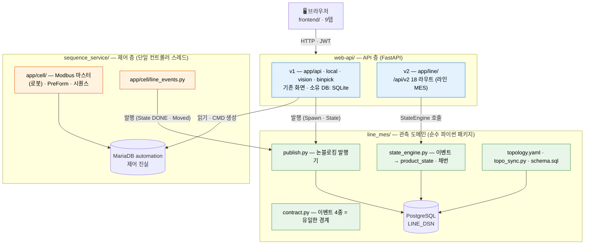
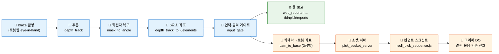

# 3D Printer Automation System

> 3D프린터-로봇 연동 자동화 시스템 | Formlabs Form 4 + HCR 협동로봇 + 3D 빈피킹 비전 (Depth + CAD) + 라인 MES

[](https://python.org)
[](https://fastapi.tiangolo.com)
[](https://react.dev)
[](https://typescriptlang.org)
[](https://tailwindcss.com)
[](https://vitejs.dev)
[](https://docker.com)
[](https://www.postgresql.org)
[](https://mariadb.org)
[](https://pytorch.org)
[](https://docs.ultralytics.com)
[](https://onnx.ai)
[](http://www.open3d.org)
[](https://pymodbus.readthedocs.io)
[](https://www.baslerweb.com)
[](https://www.intelrealsense.com)
[](https://mosquitto.org)
[](https://www.cloudflare.com)

---

## 프로젝트 개요

점자프린터 플라스틱 부품(약 20종) 생산 공정을 자동화하는 시스템입니다.

- **셀A (프린팅 라인)**: 프린터 4대 → 세척 → 건조 → 경화를 로봇과 통합 제어 서버가 관리
- **셀B (후가공 라인)**: 빈피킹 비전으로 부품을 찾아 집고 드릴·트림 스테이션으로 이송
- **라인 MES**: 배치(빌드플레이트)와 부품이 "지금 어디 있나"를 관측하는 도메인 + 모니터링·제어 대시보드

### 하드웨어 구성

**셀A — 프린팅 라인**

| 장비 | 모델 | 수량 | 용도 · 상태 |
|------|------|------|------|
| 3D 프린터 | Formlabs Form 4 | 4대 | SLA 레진 프린팅 (Cloud API 모니터링 · Local API 출력) |
| 세척기 / 경화기 | Form Wash / Form Cure | 2 / 1 | 제어 API 없음 → 상태 감시로 완료 판정 |
| 협동로봇 | 한화 HCR-12A | 1대 | 빌드플레이트 교체 · 세척기 투입 (Modbus TCP 8단계 핸드셰이크) |
| 주행 레일 · 서보 | 레일 2.5m 급 · 서보 모델 선정 중 | 1식 | 로봇 좌우 주행 — 드라이버 통신 방식(펄스 / RS-485 / EtherCAT)에 따라 모션 컨트롤 카드 또는 RS-485 컨버터 |
| 빌드플레이트 거치대 · 랙 | 자체 설계 | — | 선입선출 적재 · 건조 공간 겸용 (설계 중) |

**셀B — 후가공 라인**

| 장비 | 모델 | 수량 | 용도 · 상태 |
|------|------|------|------|
| 협동로봇 | 한화 HCR-10L | 1대 | 빈피킹 · 드릴 스테이션 이송 (산업용 PC 와 TCP 소켓 · 펜던트 Rodi-Script) |
| 전동 그리퍼 | JEGB-4285P-3MA (2지 평행 · 스트로크 85mm) | 1대 | 로봇 DO 4비트 제어 · 완료 신호 3종 (열림·물음·빈손) |
| 3D 카메라 | Basler Blaze-112 (ToF · 24VDC) | 1대 | 빈피킹 Depth — 인식 모델 입력 (eye-in-hand) |
| 2D 카메라 | Basler ace2 5MP (IMX547) + 8mm C-mount | 1대 | 컬러 영상 (Blaze 와 한 브라켓 · 정합 완료 · 융합은 보류) |
| 드릴·연마 타워 | 스핀들 3 (드릴 14,000rpm ×2 · 연마 24,000rpm ×1) · 인버터 2 | 1식 | 로봇 DO → 릴레이 → 인버터 ON/OFF · 공압 지그 클램프 |
| 리그립 스테이션 | 공구 박스 베이스 + 알루미늄 상판 + V홈 블록 | 1식 | 측면 홀 가공용 부품 뒤집기 (90°+90°) — 제작 중 |
| 바텀비전 | 하방 카메라 + 조명 | 1식 | 기존 홀 위치 보정 (협력사 중단분 인수 · 재배치 예정) |
| 깊이 카메라 | Intel RealSense D435 | 1대 | 개발·검증용 |

**치수검사 — 경화 직후 · 드릴 이전**

| 장비 | 모델 | 수량 | 용도 · 상태 |
|------|------|------|------|
| 검사 카메라 | 12.4MP GigE PoE 글로벌셔터 모노 (IMX304) | 1대 | 외관 치수 · 미성형 검출 (홀은 유무 판정) — 도입 중, 대여 모듈로 선행 개발 |
| 광학계 | 텔레센트릭 렌즈 (시야 약 64×47mm) · 링 라이트 · 백라이트 (실루엣 · 24VDC) · 정렬·클램핑 기구 | 1식 | Opto Engineering 계열 |
| 기준물 | 캘리브레이션 타겟 + 홀더 · 글라스 스테이지 | 1식 | 픽셀-mm 환산 · 반복성 검증 |
| 지그 · 차광 | 수직 광축 프로파일 프레임 + 글라스 높이·수평 조절 | 1식 | 자체 설계 (제작 중) |
| 검사 PC | Windows 일반 PC (내장 그래픽 · PoE 랜카드) | 1대 | OpenCV 치수 측정 (CPU) |

**상태 감시 · 현장 신호**

| 장비 | 모델 | 수량 | 용도 · 상태 |
|------|------|------|------|
| 리모트 I/O | ICP DAS PET-2255U (8DI/8DO · PoE) | 2대 | 세척기·경화기·건조기·타워램프 신호 (입고 · 결선 전) |
| 리모트 I/O | ICP DAS PET-7015 (RTD 입력) | 1대 | 건조 공정 온도 (센서 별도) |
| PoE 스위치 | 8포트 PoE | 1대 | 리모트 I/O · 검사 카메라 급전 |
| 모니터링 카메라 | Logitech C270 | 3대 | 장비 가동·플레이트 유무 (형상 판정) |
| 모니터링 카메라 | Raspberry Pi HQ (IMX477) + 8mm M12 | 2대 | 장비 화면 숫자 판독 (OCR) |
| 온디바이스 카메라 | OpenMV N6 · Sipeed MaixCAM | 1 / 1 | 온디바이스 상태 판독 (N6 도입 중 · MaixCAM 검증용) |
| 작업자 패널 | 12.7" 태블릿 | 2대 | 셀별 작업자 입력·확인 (도입 중) |

**연산 · 네트워크**

| 장비 | 모델 | 수량 | 용도 · 상태 |
|------|------|------|------|
| 산업용 PC | IPC-510 (i7 · RTX 5060 8GB · 32GB · Windows 11 IoT) | 1대 | 셀B 비전 추론 · 로봇 소켓 · 카메라 2대 — 포트별 고정 배선 |
| 공장 PC | Windows | 1대 | web-api · sequence_service · PreFormServer · MariaDB (NSSM 서비스) |
| 클라우드 VM | Linux | 1대 | 외부 모니터링 (Cloudflare Tunnel) |
| 엣지 AI 서버 | NVIDIA Jetson AGX Thor | 1대 | 모니터링 카메라 3대 + 빈피킹 추론 이관 (도입 중 · ARM64 환경 재구축 필요) |
| 엣지 AI 보드 | AMD Kria KV260 · BeagleBone AI-64 · Rubik Pi 3 | 각 1 | 온디바이스 추론 검증 |
| UPS | 2200VA / 1200W 정현파 | 2대 | 제어반 · PC 전원 백업 |
| 학습 서버 | NVIDIA A100 80GB (외부 컨테이너) | 1 | 인식 모델 학습 |

---

## 개발 단계

| Phase | 항목 | 상태 |
|-------|------|------|
| **Phase 1** | Web API 모니터링 (Formlabs Cloud) | ✅ 완료 |
| **Phase 2** | Local API 원격 프린트 제어 + 프론트엔드 UI | ✅ 완료 |
| **Phase 3** | HCR 로봇 연동 + 시퀀스 서비스 (Modbus 8단계 핸드셰이크) | ✅ 운영 |
| **Phase 4** | 장비 상태 감시 (세척기·경화기) | 🔄 리모트 I/O 입고 · 카메라 판독(규칙 기반 + 문자 인식) 경로와 병행 검토 |
| **Phase 5** | 3D 빈피킹 비전 시스템 | 🔄 **Depth+CAD 인식 모델 확정 · 산업용 PC 배포 · 로봇 소켓 통신·그리퍼·티칭 좌표 집기·팔 카메라 실물 인식 완료** → 인식 좌표로 집기 시험 단계 |
| **Phase 6** | 라인 MES v2 (관측 도메인 + `/api/v2` + 라인 모니터링·공정 제어 탭) | 🔄 백엔드 18 라우트 완료, 운영 DB 적용 대기 |

---

## 시스템 아키텍처

세 서비스가 **방향**으로 갈린다 — 쓰는 쪽(제어) · 읽는 쪽(관측) · 보여주는 쪽(API).


```mermaid
flowchart TB
    FE["🖥️ 브라우저<br/>frontend/ · 9탭"]
    subgraph API["web-api/ — API 층 (FastAPI)"]
        V1["v1 — app/api · local · vision · binpick<br/>기존 화면 · 소유 DB: SQLite"]
        V2["v2 — app/line/<br/>/api/v2 18 라우트 (라인 MES)"]
    end
    subgraph DOM["line_mes/ — 관측 도메인 (순수 파이썬 패키지)"]
        C["contract.py — 이벤트 4종 = 유일한 경계"]
        SE["state_engine.py — 이벤트 → product_state · 채번"]
        PUB["publish.py — 논블로킹 발행기"]
        TOPO["topology.yaml · topo_sync.py · schema.sql"]
        PG[("PostgreSQL<br/>LINE_DSN")]
    end
    subgraph CTL["sequence_service/ — 제어 층 (단일 컨트롤러 스레드)"]
        SEQ["app/cell/ — Modbus 마스터(로봇) · PreForm · 시퀀스"]
        LE["app/cell/line_events.py"]
        MDB[("MariaDB automation<br/>제어 진실")]
    end

    FE -- "HTTP · JWT" --> API
    V1 -- "읽기 · CMD 생성" --> MDB
    V2 -- "StateEngine 호출" --> SE
    V1 -- "발행 (Spawn · State)" --> PUB
    SEQ --> MDB
    LE -- "발행 (State DONE · Moved)" --> PUB
    SE --> PG
    PUB --> PG
    TOPO --> PG

    classDef api fill:#e3f2fd,stroke:#1976d2,color:#000
    classDef dom fill:#e8f5e9,stroke:#388e3c,color:#000
    classDef ctl fill:#fff3e0,stroke:#e65100,color:#000
    class V1,V2 api
    class C,SE,PUB,TOPO dom
    class SEQ,LE ctl
```

| 서비스 | 역할 | 소유 DB | 프로세스 |
|---|---|---|---|
| `web-api/` | 브라우저가 보는 전부 — 인증 · v1 화면 API · v2 라인 MES API · 정적 파일 | SQLite | uvicorn 1개 |
| `line_mes/` | 관측 도메인 — 제품 위치 규칙·스키마. HTTP 없음, 상주 프로세스 없음 | PostgreSQL (`schema.sql` 18테이블·24뷰) | 없음 (두 서비스가 `import`) |
| `sequence_service/` | 제어 — 프린터 출력 지시 · 로봇 반송 · 셀 상태. **로봇에 쓰는 유일한 자리** | MariaDB `automation` | 스레드 1개 |

**원칙**
- 의존은 한 방향: `web-api → line_mes ← sequence_service`. `line_mes/`는 표준 라이브러리 + psycopg + yaml 외 아무것도 import하지 않는다.
- 발행은 논블로킹이고 실패해도 제어를 막지 않는다. `LINE_DSN`이 비면 v2 전체가 no-op(라우트 503, 발행 skip, 프론트는 목업).
- 위치를 바꾸는 이벤트는 `Moved` 뿐. 카메라·프린터 API는 `State`만 낸다.
- 세 DB 병존 · 기존 DDL 0 변경. 다리는 `unit.cmd_id = print_command.cmd_id` 한 컬럼.

**허브 개념**: 로봇·프린터·카메라 같은 실시간 제어는 공장 PC 로컬에서 직접 처리(네트워크 장애 시에도 안전). 원격 모니터링·UI·이력 조회만 Cloudflare Tunnel을 통해 제공.

### 라인 MES 이벤트 발행 지점

| 이벤트 | 발행 지점 | 소스 |
|---|---|---|
| `Spawn` 배치 투입 | web-api `/local/print` 전송 성공 직후 | ADAPTER |
| `State` 프린터 RUN/HOLD | web-api 폴링 서비스 (15초) | ADAPTER |
| `State` 프린터 DONE | sequence_service 프린터 시퀀스 (`cmd_status=40`) | ADAPTER |
| `State` 세척기·경화기 | web-api 상태 감시 (리모트 I/O 입력) | DEVICE |
| `Moved` 로봇 이송 완료 | sequence_service 로봇 시퀀스 (레지스터 206) | ROBOT |
| `Split` · `Moved` · `State` 작업자 | web-api `/api/v2` 쓰기 W1~W6 | MANUAL |

---

## 빈피킹 (Phase 5)

### 운영 트랙 — Depth + CAD 인식 (`bin_picking/depth_track/` + `bin_picking/src/`)

ToF 거리 영상 하나로 부품 27종을 찾고 종류를 가린다. 색·재질과 무관하고, CAD 도면이 있으면 실물 데이터 없이도 학습을 시작할 수 있다(실측 소량 fine-tune 이 성능의 열쇠).

| 구성 | 내용 |
|---|---|
| 모델 | 2D 거리영상 검출기 + CAD 형상 코드북 (3D 인코더 PointNet++ · 2D VQ 인코더 · 검출 헤드) — 산학 부트캠프 산출물을 회사 자산으로 편입 |
| 입력 | Basler Blaze-112 depth (848×480, uint16 → m 단위 단일 출처 `depth_units.py`) |
| 출력 | 6요소 좌표 (x, y, z, edge, angle, label) + 장면 게이트 판정 → 웹 보고 / 로봇 전송 |
| 모델 선택 | 두 촬영 조건을 함께 학습한 판이 상위를 독점 — 지렛대는 장수가 아니라 **촬영 조건의 폭** · seed 노이즈(F1 ±0.08)보다 작은 차이는 "구분 불가"로 본다 |

**현재 성능 (모델 확정 · 재설치 후 다른 날 촬영본 30장)**

| 지표 | 값 |
|---|---|
| 인식 F1 | **0.88** (이전 운영 모델 0.64) |
| 부품 종류 정답률 | 88.8% |
| 집을 수 있는 비율 (안전여유 10mm · 계산값) | 100% (206/206) |
| 산업용 PC 추론 속도 | **장당 1.3초** (CPU · 개발 서버와 소수점까지 일치) |

> 수치는 학습이 본 촬영 조건의 시험지 기준이고, 파지 100%는 부품 치수와 대조한 계산값이다. 실물 파지는 로봇으로 검증 중이며 **실물 시험 중에는 모델을 바꾸지 않는다**(바꿔가며 하면 실패 원인을 못 가린다).

### 인식 → 로봇 사슬


```mermaid
flowchart LR
    Cam["📸 Blaze 촬영<br/>(로봇팔 eye-in-hand)"]
    Infer["🧠 추론<br/>depth_track"]
    Angle["📐 회전각 복구<br/>mask_to_angle"]
    Six["🧮 6요소 좌표<br/>depth_track_to_6elements"]
    Gate["🚧 입력·출력 게이트<br/>input_gate"]
    Web["🌐 웹 보고<br/>web_reporter → /binpick/reports"]
    Base["🔁 카메라→로봇 좌표<br/>cam_to_base (3점법)"]
    Sock["🔌 소켓 서버<br/>pick_socket_server"]
    Rodi["🤖 펜던트 스크립트<br/>rodi_pick_sequence.js"]
    Grip["🤏 그리퍼 DO<br/>열림·물음·빈손 신호"]

    Cam --> Infer --> Angle --> Six --> Gate
    Gate --> Web
    Gate --> Base --> Sock --> Rodi --> Grip

    classDef vision fill:#e3f2fd,stroke:#1976d2,color:#000
    classDef robot fill:#fff3e0,stroke:#e65100,color:#000
    classDef out fill:#e8f5e9,stroke:#388e3c,color:#000
    class Cam,Infer,Angle,Six,Gate vision
    class Base,Sock,Rodi,Grip robot
    class Web out
```

- **빈피킹 좌표는 Modbus 로 가지 않는다.** 로봇이 클라이언트로 산업용 PC 소켓 서버에 접속해 JSON 포즈를 받고, 펜던트 스크립트가 `createPose → moveLinear` 로 실행한다. Modbus TCP 는 셀A 이송 핸드셰이크 전용.
- **정합 파일이 없으면 소켓 서버가 시작을 거부한다** — 카메라 좌표를 그대로 로봇에 보내는 경로를 코드로 막았다. 로봇 작업영역 밖 좌표·신뢰할 수 없는 회전각은 전송하지 않는다.
- 게이트 = 학습 분포를 벗어난 장면(유효율·크기)을 걸러 "배경을 부품으로 잡은 결과"가 정상처럼 보이지 않게 한다.

**로봇 연동 단계**

| 단계 | 상태 |
|---|---|
| 산업용 PC ↔ 로봇 소켓 왕복 · 좌표 수신 · 완료 회신 | ✅ |
| 로봇 DO 로 그리퍼 개폐 · 완료 신호 3종(열림·물음·빈손) | ✅ |
| 티칭 좌표로 한 개 집기 (1사이클) | ✅ |
| 로봇팔 카메라로 실물 장면 인식 | ✅ |
| 인식 좌표로 로봇 이동 → 집기 | 🔜 시험 단계 |
| 집어서 드릴 스테이션까지 (리그립 · 바텀비전 보정) | ⏳ |

### 보존 트랙 (운영에 쓰지 않음)

- **YOLO 2D 트랙** (`bin_picking/yolo_track/`): 컬러 영상 5종 비교 학습, 같은 환경 mAP50 0.99 — 다른 날 촬영본에서 일반화가 확인되지 않아 Depth 트랙으로 전환. 데이터·학습 인프라는 보존.
- **6DoF Pose 트랙** (`bin_picking/src/recognition/`): CAD 라이브러리 + FPFH + Colored ICP (L1~L6, Open3D). 인식률 easy 100% / crowded 90% / hard 60%, RMSE 1.0~1.5mm. 레진별 프리셋 4종. 카메라 캘리브레이션·eye-in-hand 자산은 운영 트랙이 그대로 사용.

---

## 주요 기능

### Phase 1: 실시간 모니터링
- Formlabs Cloud API 폴링 → WebSocket 실시간 push
- 프린터 4대 그리드 대시보드 + 타임라인 간트 차트 + 상세 모달
- 프린트 이력 + 통계

### Phase 2: 원격 프린트 제어
- 파일 업로드 → 프리셋 저장 → 프린터로 전송 (PreFormServer)
- 프리셋 CRUD · readiness 체크 · 유효성/간섭 검사 · 대기 큐 · 알림벨
- 프린터 벤더 어댑터(`PRINTER_VENDOR`, 현재 formlabs)

### Phase 3: 자동화 셀 제어
- sequence_service: 단일 컨트롤러 스레드, 설비별 시퀀스(프린터·세척·경화·로봇), MariaDB 상태 전이
- Modbus TCP 8단계 핸드셰이크 (레지스터 130 명령 · 131~135 파라미터 · 150/151 · 200/206) — 명령표는 `sequence_service/README.md`
- 자동화 탭(CMD 생성·셀 START/STOP) + 수동제어 탭(DIO·Modbus·TCP 송신, 조작 기록 남김)

### Phase 4: 장비 상태 감시
- 세척기·경화기·건조기 신호를 **리모트 I/O**(PoE 이더넷 DI/DO, Modbus TCP)로 통합 수집 → 상태 전이 저장 → WebSocket 푸시
- Form Wash/Cure 는 제어 API 가 없으므로 장비 신호선·버튼을 리모트 I/O 에 결선해 완료/대기를 읽는다
- 엣지 AI 카메라(MaixCAM)는 보조 PoC — 화면 숫자 판독(OCR)·플레이트 유무 확인용

### Phase 5: 3D 빈피킹 비전 시스템
- Depth 단독 인식 (CAD 코드북) → 6요소 좌표 + 회전각 + 장면 게이트 → 웹 보고 (`POST /api/v1/binpick/reports`)
- 카메라→로봇 좌표 변환 계층 (3점법 정합 파일 · 작업영역 검사 · 배선 검사) + 소켓 서버 + 펜던트 Rodi-Script
- 그리퍼 파지 계획 (`grasp_database.yaml` 29종 · 안전여유 런타임 상수) · 파지 자세 보정 절차·계산기
- 산업용 PC 배포 검증 (개발 서버와 추론 결과 소수점 일치 · 장당 1.3초) · 카메라 2대 연결 절차서
- 한 명령 E2E 러너 (`run_binpick_e2e.py` · `run_live_pick.py`) · 펜던트 스크립트 시뮬레이터 (112 케이스)

### Phase 6: 라인 MES v2
- 관측 도메인 패키지 `line_mes/` (이벤트 4종 contract · state_engine · 토폴로지 적재 · 시뮬레이터)
- `/api/v2` 18 라우트: 읽기 R1~R12(노드 현황·반송자원·재공·투입 대기·랙 칸·FIFO 대기열·묶음·판정·명령 카탈로그·부품 마스터) + 쓰기 W1~W6(배치 분리·이동·상태·판정·조작 기록·로봇 명령). 읽기는 ETag/304.
- 프론트 전환 스위치는 서버 한 값: `/system/config.line_mes` (= `LINE_DSN` 유무). 꺼져 있으면 목업으로 동작.
- 기존 자동화 CMD 목록에 `line_tracked` 대조 — Spawn 누락 CMD를 바로 드러낸다.

### 웹앱 인프라
- systemd user service로 자동 시작 + 크래시 재시작 (공장 PC 는 NSSM 서비스 + `deploy.bat`)
- JWT 토큰 기반 인증 + React 로그인 페이지 + sliding refresh (HTTP + WebSocket + OpenAPI 문서 모두 보호)
- Cloudflare Tunnel을 통한 외부 접속 (내부 네트워크 비노출)
- 프린터 시리얼 단일 출처 `PRINTER_SERIAL_MAP` — web-api · sequence_service · topo_sync가 전부 여기서 읽는다

---

## 프론트엔드 UI (9탭)

| 탭 | 기능 |
|----|------|
| 모니터링 | 프린터 4대 그리드, 상태 필터, 타임라인 |
| 프린트 제어 | 프린터별 독립 컨테이너 (업로드·프리셋·프린트) |
| 대기 중인 작업 | 드래그앤드롭 순서 변경, 예약 시간 |
| 이전 작업 내용 | 로컬+클라우드 이력, 필터, CSV, 메모 |
| 통계 | 재료 도넛, 일별 바, 프린터별 가동률 |
| 자동화 | CMD 생성·프린터 할당·셀 제어·진행 상황 |
| 자동화 수동제어 | DIO·Modbus·TCP 수동 송신 (관리자용) |
| 라인 모니터링 | 노드 점유·반송자원 큐·재공 파이프라인 (v2 폴링) |
| 공정 제어 | 설비별 투입 대기·랙 칸·배치 분리·부품 판정·로봇 명령 (v2) |

> 자동화 두 탭은 공장 PC에서 시퀀스 서비스가 실행 중일 때, 라인 두 탭은 `LINE_DSN`이 설정됐을 때 실제 데이터로 동작한다. 그 외엔 각각 비활성/목업.

---

## 공정 흐름

| # | 공정 | 담당 |
|---|------|------|
| ① | STL 파일 업로드 | 사용자 (웹/앱) |
| ② | 프린터로 작업 전송 (+ 라인 MES `Spawn`) | 백엔드 (Local API) |
| ③ | 빌드플레이트 랙 → 프린터 투입 | HCR-12A |
| ④ | 3D 프린팅 | Form 4 |
| ⑤ | 프린팅 완료 감지 | 백엔드 (Web API 폴링 + 시퀀스 `cmd_status`) |
| ⑥~⑦ | 빌드플레이트 픽업 → 세척기 투입 (`Moved`) | HCR-12A |
| ⑧ | 세척 완료 감지 (`State`) | 리모트 I/O |
| ⑨ | 빌드플레이트 세척기 → 랙 투입 (`Moved`) | HCR-12A |
| ⑩ | 부품 분리 (`Split`) | 작업자 (공정 제어 탭) |
| ⑪ | 서포트 제거 | 작업자 |
| ⑫ | 경화기 투입 | 작업자 |
| ⑬ | 경화 완료 감지 (`State`) | 리모트 I/O |
| ⑭ | 치수 검사 | 광학계 (구축 중) |
| ⑮ | 빈피킹 → 드릴·트림 스테이션 이송 | HCR-10L + Blaze/ace2 |
| ⑯ | 양품/불량 판정 → 적재 | 작업자 / HCR-10L |
| ⑰ | 완료 보고 | 백엔드 (알림) |

---

## API 엔드포인트

전체 표는 `web-api/README.md`. `GET /api/v1/system/config` 가 프론트 설정의 단일 출처다 (`printer_serial_map` · `line_id` · `line_mes`).

### 인증
```
POST /api/v1/auth/login           # 로그인 → JWT (7일 sliding, 30일 절대 최대)
GET  /api/v1/auth/me              # 현재 세션
POST /api/v1/auth/logout
```

### Phase 1: Web API 모니터링
```
GET  /api/v1/dashboard                    # 4대 프린터 상태 요약
GET  /api/v1/printers                     # 프린터 목록
GET  /api/v1/printers/{serial}            # 특정 프린터 상태
GET  /api/v1/printers/{serial}/refresh    # 상태 즉시 새로고침
GET  /api/v1/printers/{serial}/prints     # 프린터별 이력
GET  /api/v1/prints                       # 프린트 이력 (필터)
GET  /api/v1/statistics                   # 통계
GET  /api/v1/system/token-status          # Formlabs 토큰 상태
GET  /api/v1/system/config                # 시스템 설정 (프린터 맵 · 라인 ID · 라인 MES on/off)
WS   /api/v1/ws                           # 실시간 업데이트
```

### Phase 2: Local API 원격 제어
```
GET    /api/v1/local/health
POST   /api/v1/local/printers/discover
CRUD   /api/v1/local/presets
POST   /api/v1/local/presets/{id}/print
POST   /api/v1/local/upload
GET    /api/v1/local/files
DELETE /api/v1/local/files/{filename}
CRUD   /api/v1/local/print                # 전송 성공 시 라인 MES Spawn 1건
CRUD   /api/v1/local/scene/*              # Scene + 모델 복제 + 유효성 + 간섭
GET    /api/v1/local/materials
POST   /api/v1/local/scene/{id}/screenshot
POST   /api/v1/local/scene/{id}/estimate-time
CRUD   /api/v1/local/notes
GET    /api/v1/local/notifications
POST   /api/v1/local/notifications/mark-read
```

### Phase 3: 자동화 셀 제어 (sequence_service 연동)
```
POST /api/v1/local/automation/commands            # Sequence CMD 생성
GET  /api/v1/local/automation/commands            # CMD 목록 (+ line_tracked 라인 MES 대조)
POST /api/v1/local/automation/commands/use
POST /api/v1/local/automation/control/{action}    # START / STOP / PAUSE / RESUME
POST /api/v1/local/automation/simul               # 시뮬 모드 토글
GET  /api/v1/local/automation/state | queues | logs
GET  /api/v1/local/automation/manual/io/state     # DIO 읽기
POST /api/v1/local/automation/manual/io/output    # DIO 쓰기 (관리자용 · 기록)
POST /api/v1/local/automation/manual/robot-send | vision-send
GET  /api/v1/local/automation/manual/robot-status | vision-status
GET/POST /api/v1/local/automation/manual/comm-config
GET  /api/v1/local/automation/manual/modbus/registers | write
```

### Phase 4: 장비 상태 감시
```
GET  /api/v1/vision/health
GET  /api/v1/vision/cameras[/{camera_id}]
GET  /api/v1/vision/devices[/{device_type}/{device_id}]   # 세척기/경화기 상태
GET  /api/v1/vision/events[/latest]                       # 상태 전이 이력
POST /api/v1/vision/simulate[/scenario]                   # 개발용
WS   /api/v1/vision/ws
```

### Phase 5: 빈피킹 결과 수신
```
POST /api/v1/binpick/reports                  # 인식 모듈 → 서버
GET  /api/v1/binpick/health
GET  /api/v1/binpick/scenes[/latest|/{pk}]    # 장면 목록·상세 (게이트 판정 필터)
WS   /api/v1/binpick/ws
```

### 라인 MES v2 (전부 JWT · 폴링 · 읽기는 ETag/304)
```
GET  /api/v2/lines/{line_id}/nodes | transporters | wip | control-menu   # R1~R4
GET  /api/v2/nodes/{node_id}/inbound | source-racks | groups | parts     # R5 R6 R9 R10
GET  /api/v2/racks/{node_id}/slots[/{slot_no}/queue]                     # R7 R8
GET  /api/v2/transporters/{id}/commands                                  # R11 명령 카탈로그
GET  /api/v2/parts                                                       # R12 부품 마스터
POST /api/v2/units/{unit_id}/split                                       # W1 배치 완료 → 부품 분리
POST /api/v2/moves                                                       # W2 이동
POST /api/v2/nodes/{node_id}/state                                       # W3 설비 상태
POST /api/v2/judgements                                                  # W4 부품 판정
POST /api/v2/commands                                                    # W5 조작 기록
POST /api/v2/transporters/{id}/commands/{command_id}                     # W6 로봇 명령 실행
```

### Formlabs API 사용 현황
- Web API: 6개 사용 (전체 19개) — 읽기 전용 모니터링
- Local API: 17개 사용 (전체 35개) — 프린트 전송·Scene 관리
- Webhook 미지원 → 폴링 방식
- Form Wash/Cure 제어 API 없음 → 리모트 I/O 신호로 완료 감지

---

## 프로젝트 구조

```
3D_printer_automation/
├── main.py                        # 통합 런처 (web-api + sequence_service)
├── requirements.txt               # 루트 의존성 (-e . 로 line_mes 포함) — deploy.bat 는 이것만 설치
├── pyproject.toml                 # line_mes 패키지 정의
├── deploy.bat                     # 공장 PC 1줄 배포
│
├── web-api/                       # API 층 (FastAPI)
│   ├── app/
│   │   ├── core/                  # 설정, Formlabs OAuth2, JWT 미들웨어
│   │   ├── api/                   # Phase 1 REST + WebSocket + 로그인
│   │   ├── local/                 # Phase 2 로컬 API + Phase 3 자동화 DB·DIO + 라인 발행
│   │   ├── adapters/              # 프린터 벤더 어댑터 (formlabs | demo)
│   │   ├── vision/                # Phase 4 상태 감시 (리모트 I/O · 카메라 PoC)
│   │   ├── binpick/               # Phase 5 인식 결과 수신
│   │   └── line/                  # 라인 MES v2 /api/v2 (routes_read · routes_write · publisher)
│   ├── .env.example
│   ├── Dockerfile / docker-compose.yml
│   └── README.md                  # 전체 라우트 표
│
├── line_mes/                      # 라인 MES 관측 도메인 (순수 파이썬 패키지)
│   ├── contract.py                # 이벤트 4종 (Spawn · State · Moved · Split)
│   ├── state_engine.py            # 이벤트 → product_state · 채번
│   ├── publish.py                 # 논블로킹 발행기
│   ├── schema.sql / schema.md     # PostgreSQL 테이블·뷰·트리거
│   ├── topology.yaml / topo_sync.py   # 라인·노드·경로 정의 → DB 적재
│   ├── simulator.py               # 이벤트 흘려 뷰 검증
│   └── tools/                     # dev_up.sh · dev_reset.sh
│
├── sequence_service/              # 제어 층 (공장 PC)
│   ├── app/cell/                  # runtime · sequences/ · modbus_protocol · line_events
│   ├── app/io/                    # Ajin IO (WinDLL)
│   └── README.md                  # 로봇암 이송 명령표
│
├── frontend/                      # React + Vite + TS + Tailwind CSS 4 (9탭)
│   └── src/{components, services/{api,localApi,lineApi,auth}.ts, mocks, types}
│
├── bin_picking/                   # Phase 5 3D 빈피킹
│   ├── depth_track/               # 운영 트랙: Depth + CAD 인식 모델 (학습·추론 코드 · 체크포인트는 리포 밖)
│   ├── src/
│   │   ├── acquisition/           # Blaze/ace2 취득 · depth 단위 · 3점법 · RGB-D 정합 · extrinsic
│   │   ├── pipeline/              # 6요소 좌표 · 회전각 복구 · 입력/출력 게이트
│   │   ├── communication/         # 소켓 서버 · cam_to_base 변환 · 파지 계획 · 웹 보고 · 정합 채집
│   │   ├── run_binpick_e2e.py     # 촬영→추론→각도→6요소→게이트→웹 한 명령
│   │   ├── run_live_pick.py       # 촬영→추론→변환→소켓 한 명령
│   │   └── recognition/ segmentation/ preprocessing/ grasping/   # 보존 트랙 (6DoF Pose)
│   ├── scripts/                   # rodi_*.js 펜던트 스크립트 (집기 시퀀스 · 정합 채집 · 소켓 · DO 맵) · Basler 셋업
│   ├── yolo_track/                # 보존 트랙 (YOLO 2D)
│   ├── config/{resin_presets.py, grasp_database.yaml}
│   ├── docs/                      # 현장 카드 (hand-eye · 파지 자세 · IPC 카메라 연결 · 모델 선택표)
│   ├── tests/                     # 자체 실행 스크립트 + simulate_rodi_pick.js
│   └── tutorials/                 # Open3D 학습
│
├── factory-pc/file_receiver.py    # STL 파일 수신
├── scripts/                       # deploy_servers.sh · dev_develop.sh · smoke test
├── wireframe/                     # 라인 화면 와이어프레임 (Vite)
├── docs/                          # 설계·레퍼런스 (docs/juhee/ = 라인 MES v2 계획·설계·API 명세)
└── kaist_backup/                  # 동결 백업 (수정 금지)
```

---

## 기술 스택

### Backend
| 기술 | 용도 |
|------|------|
| Python 3.11+ · FastAPI · uvicorn | REST + WebSocket |
| httpx · pydantic-settings | Formlabs API 호출 · 환경변수 |
| SQLAlchemy + SQLite | web-api 로컬 DB |
| PyMySQL + MariaDB 11 | 자동화 제어 DB (sequence_service, 공장 PC) |
| psycopg 3 + PostgreSQL | 라인 MES 관측 DB (`line_mes/`) |
| pymodbus 3.x | 로봇 Modbus TCP 핸드셰이크 · 리모트 I/O 상태 감시 |
| aiomqtt | 엣지 AI 카메라 PoC (MQTT) |
| bcrypt + python-jose | JWT 로그인 |

### Frontend
React 18 · TypeScript 5 · Vite 5 · Tailwind CSS 4 · WebSocket (v1) / 폴링 + ETag (v2)

### 빈피킹 비전 (Phase 5)

**운영 트랙 (Depth + CAD)**: PyTorch 2.x · CAD 코드북 (PointNet++ · VQ) · NumPy · SciPy · Pillow · pypylon (Basler Blaze-112 + ace2) · 로봇 = 한화 Rodi-Script (펜던트) + TCP 소켓 (JSON)

**보존 트랙**: Ultralytics YOLOv8/v11 · Roboflow · ONNX (YOLO 2D) / Open3D 0.19 · OpenCV · trimesh · pyrealsense2 (6DoF Pose)

**학습 인프라**: NVIDIA A100 80GB GPU · 컨테이너 환경 / **배포**: 산업용 PC (Windows · CPU 추론으로 응답 목표 충족) → 엣지 AI 보드 (추후)

### Infrastructure
Docker · systemd --user · NSSM (Windows 서비스) · Cloudflare Tunnel · MQTT (Mosquitto, 카메라 PoC)

---

## 설치 및 실행

### 사전 요구사항
- Python 3.11+ · Node.js 18+
- (선택) Docker + docker-compose
- (라인 MES) PostgreSQL 14+
- (공장 PC) MariaDB 11 · PreFormServer · Windows

### 1. 환경 변수

`web-api/.env.example`을 복사해 `web-api/.env`를 만든다. **sequence_service도 같은 파일을 읽는다.**

```bash
# Formlabs Web API
FORMLABS_CLIENT_ID=your_client_id
FORMLABS_CLIENT_SECRET=your_client_secret

# 프린터 번호(1~4) ↔ 시리얼. 시리얼의 유일한 손 편집 지점
PRINTER_SERIAL_MAP={"1":"SERIAL1","2":"SERIAL2","3":"SERIAL3","4":"SERIAL4"}

# PreFormServer / 파일 수신
PREFORM_SERVER_HOST=127.0.0.1
PREFORM_SERVER_PORT=44388
FILE_RECEIVER_HOST=127.0.0.1
FILE_RECEIVER_PORT=8089

# 라인 MES v2 — 비우면 v2 전체 no-op. 비번은 DSN 에 넣지 말고 PGPASSWORD/.pgpass 로
LINE_DSN=
LINE_ID=RESIN-1-ASIS     # topology.yaml 의 active 라인과 같아야 한다

# 사용자 로그인 (JWT) — 셋 다 비면 인증 OFF (로컬 개발용)
AUTH_USERNAME=your_username
AUTH_PASSWORD_HASH=      # python -c "import bcrypt; print(bcrypt.hashpw(b'pw', bcrypt.gensalt(rounds=12)).decode())"
JWT_SECRET=              # python -c "import secrets; print(secrets.token_urlsafe(32))"
```

> **⚠️ `.env`는 절대 커밋하지 마세요.** credentials·IP·시리얼·경로는 로컬 설정 파일에서만 관리합니다.

### 2. 라인 MES DB (선택)

```bash
psql -f line_mes/schema.sql
python -m line_mes.topo_sync --check     # --plan → --apply
python -m line_mes.simulator             # 이벤트를 흘려 뷰 검증 (개발용)
# 이후 .env 의 LINE_DSN 을 채우면 v2 라우트·발행·프론트 라인 탭이 함께 켜진다
```

### 3. 실행

**방법 1: Docker** (web-api 만)
```bash
cd web-api
docker-compose up -d
```

**방법 2: 직접 실행**

백엔드 (web-api + sequence_service — 리포 루트에서):
```bash
python -m venv .venv
source .venv/bin/activate        # Windows: .venv\Scripts\activate
pip install -r requirements.txt  # line_mes 가 -e . 로 함께 설치된다
python main.py                   # web-api :8085 + sequence_service
```

web-api 만:
```bash
cd web-api
python -m venv venv
source venv/bin/activate         # Windows: venv\Scripts\activate
pip install -r requirements.txt
uvicorn app.main:app --host 0.0.0.0 --port 8085
```

프론트엔드 (개발):
```bash
cd frontend
npm install
npm run dev                      # :5180 → API 프록시 :8085
```

프론트엔드 (프로덕션 빌드):
```bash
cd frontend
npm run build
# dist/ 가 web-api에서 정적 서빙됨
```

개발용 포트 분리 (vite 5181 → web-api 8086, main 5180/8085 와 병행):
```bash
./scripts/dev_develop.sh
```

### 4. 빈피킹 실행

```bash
# 산업용 PC — 소켓 서버 (로봇이 접속해 좌표를 받아간다 · 정합 파일 필수)
python -m bin_picking.src.communication.pick_socket_server --mode vision --calib <정합 파일> --cycles 0

# 촬영 → 추론 → 변환 → 소켓 한 명령 (현장 시험용)
python bin_picking/src/run_live_pick.py --capture --calib <정합 파일> --help

# 저장 프레임으로 인식 → 6요소 → 게이트 → 웹 보고 (검증용)
python bin_picking/src/run_binpick_e2e.py --help

# 카메라↔로봇 정합 파일 생성 (3점법) · 검증
python -m bin_picking.src.communication.cam_to_base build --help
python -m bin_picking.src.communication.cam_to_base check --help

# 펜던트 스크립트 로직 시뮬레이션 (로봇 없이)
node bin_picking/tests/simulate_rodi_pick.js
```

현장 절차는 `bin_picking/docs/` 카드(hand-eye · 파지 자세 보정 · IPC 카메라 연결)를 따른다.

---

## 문서

| 위치 | 내용 |
|---|---|
| `web-api/README.md` | 전체 라우트 표 (v1 61 + v2 18) |
| `sequence_service/README.md` | 로봇암 이송 명령표 · 레지스터 |
| `line_mes/README.md` · `schema.md` | 관측 도메인 파일 역할 · DB 스키마 |
| `docs/juhee/` | 라인 MES v2 조사 → 계획 → 설계 정본 → API 명세 → 와이어프레임 → FE 병합 |
| `docs/juhee/03_MES_v2_설계/서비스_역할_구조.md` | 세 서비스 역할·DB 소유·의존 방향 한 장 |
| `bin_picking/docs/README.md` | 빈피킹 절차서 색인 (현행 / 완료 기록 / 종료) |
| `bin_picking/docs/HAND_EYE_CARD.md` · `GRASP_ANGLE_CARD.md` · `IPC_CAMERA_CONNECT.md` | 현장 카드 — 카메라↔로봇 정합 · 파지 자세 보정 · 카메라 2대 연결 |

---

## 라이선스

내부 프로젝트 (Private)

---

_Last updated: 2026-10-02_
